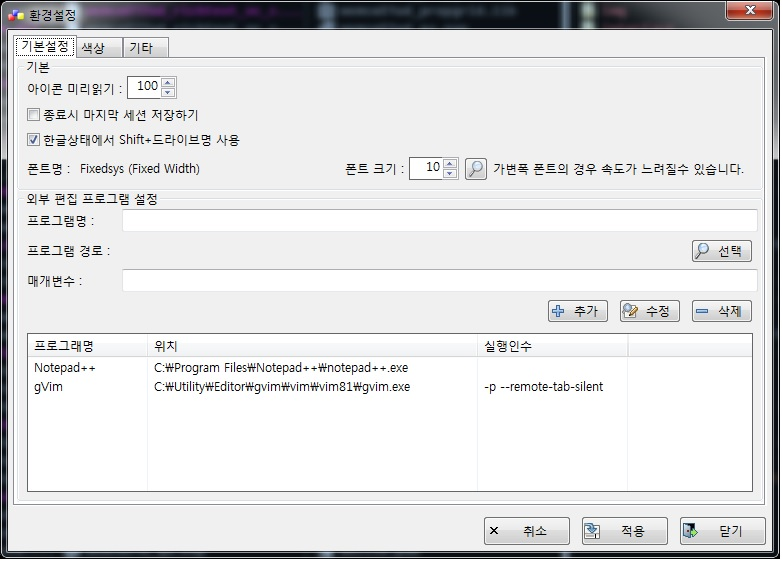

# SHFiles

###  설명

- SHFiles는 윈도우(MacOS, Linux 개발예정)의 탐색기 대체용 파일매니저입니다..
- 기존 [SHCommanderX](https://github.com/bbygoodluck/SHCommanderX)를 재구성하였으며 UI변화는 없으며 기존 소스코드에서 복잡한 처리를 단순화 하고 중복코드 제거, 알고리즘 변경으로 속도 및 안정성을 향상 시켰습니다.
- Cross-Platform 개발을 위해 컴파일러를 VisualC++ → gcc 로 변경하였으며 그로 인해 실행파일의 크기가 1M정도 증가하였습니다.
- SHFiles의 SH는 큰 아들 이름의 이니셜입니다.
- License는 GPL v3를 따르고 있습니다.

### 개발환경

- GUI : wxWidgets 3.1.3 Unicode Build
- IDE : CodeLite 14.0.0
- Compiler : gcc 10.1.0

### wxWidgets Build(gcc Dll Version)

```
Release
	64bit
		mingw32-make -j8 -f makefile.gcc SHARED=1 UNICODE=1 CFG=x64 CXXFLAGS="-std=c++17" BUILD=release clean
		mingw32-make -j8 -f makefile.gcc setup_h SHARED=1 UNICODE=1 CFG=x64 CXXFLAGS="-std=c++17" BUILD=release

		Next, open the file: \path\to\wxwidgets\lib\gcc_dllx64\mswu\wx\setup.h and ensure that wxUSE_GRAPHICS_CONTEXT is set to 1:

		#define wxUSE_GRAPHICS_CONTEXT 1

		mingw32-make -j8 -f makefile.gcc SHARED=1 UNICODE=1 CFG=x64 CXXFLAGS="-std=c++17" BUILD=release

	32bit
		mingw32-make -j8 -f makefile.gcc SHARED=1 UNICODE=1 CXXFLAGS="-std=c++17" BUILD=release clean
		mingw32-make -j8 -f makefile.gcc setup_h SHARED=1 UNICODE=1 CXXFLAGS="-std=c++17" BUILD=release

		Next, open the file: \path\to\wxwidgets\lib\gcc_dll\mswu\wx\setup.h and ensure that wxUSE_GRAPHICS_CONTEXT is set to 1:

		#define wxUSE_GRAPHICS_CONTEXT 1

		mingw32-make -j8 -f makefile.gcc SHARED=1 UNICODE=1 CXXFLAGS="-std=c++17" BUILD=release

============================================================================================================
Debug
	64bit
		mingw32-make -j8 -f makefile.gcc SHARED=1 UNICODE=1 CFG=x64 CXXFLAGS="-std=c++17" BUILD=debug clean
		mingw32-make -j8 -f makefile.gcc setup_h SHARED=1 UNICODE=1 CFG=x64 CXXFLAGS="-std=c++17" BUILD=debug

		Next, open the file: \path\to\wxwidgets\lib\gcc_dll\mswu\wx\setup.h and ensure that wxUSE_GRAPHICS_CONTEXT is set to 1:

		#define wxUSE_GRAPHICS_CONTEXT 1

		mingw32-make -j8 -f makefile.gcc SHARED=1 UNICODE=1 CFG=x64 CXXFLAGS="-std=c++17" BUILD=debug

	32bit
		mingw32-make -j8 -f makefile.gcc SHARED=1 UNICODE=1 CXXFLAGS="-std=c++17" BUILD=debug clean
		mingw32-make -j8 -f makefile.gcc setup_h SHARED=1 UNICODE=1 CXXFLAGS="-std=c++17" BUILD=debug

		Next, open the file: \path\to\wxwidgets\lib\gcc_dll\mswu\wx\setup.h and ensure that wxUSE_GRAPHICS_CONTEXT is set to 1:

		#define wxUSE_GRAPHICS_CONTEXT 1

		mingw32-make -j8 -f makefile.gcc SHARED=1 UNICODE=1 CXXFLAGS="-std=c++17" BUILD=debug
```

### ScreenShot

* Main

* Directory Manager

* Favorite

* File Find

* Key input and match item

* Setting environment
  


### json lib

* [rapidjson homepage](http://rapidjson.org/)

### Zip Library

- [zlib](https://zlib.net)
- [폴더압축 참조(Win32 Wrapper class - Visual C++ Version)](https://www.codeproject.com/Articles/4288/Win32-Wrapper-classes-for-Gilles-Volant-s-Zip-Unzi)


